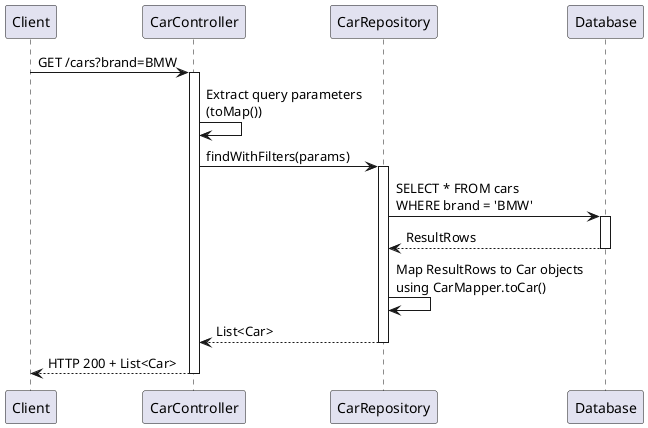
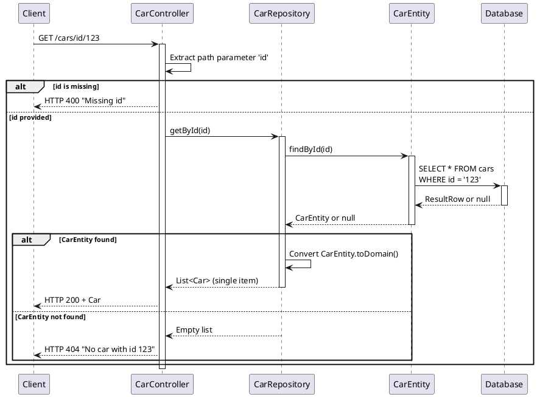
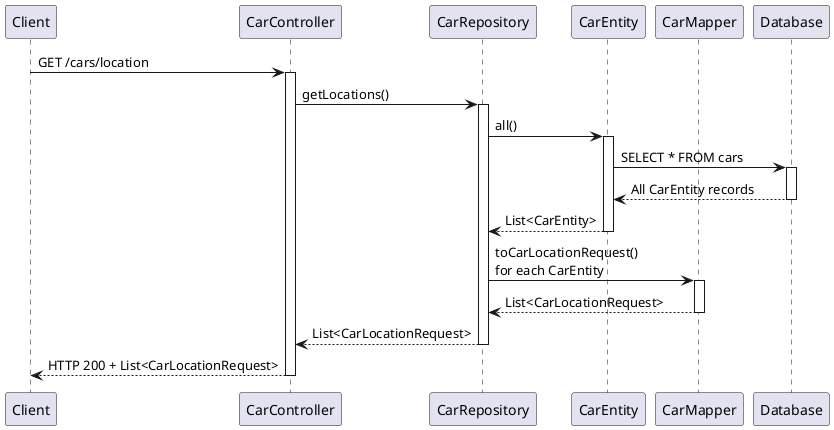
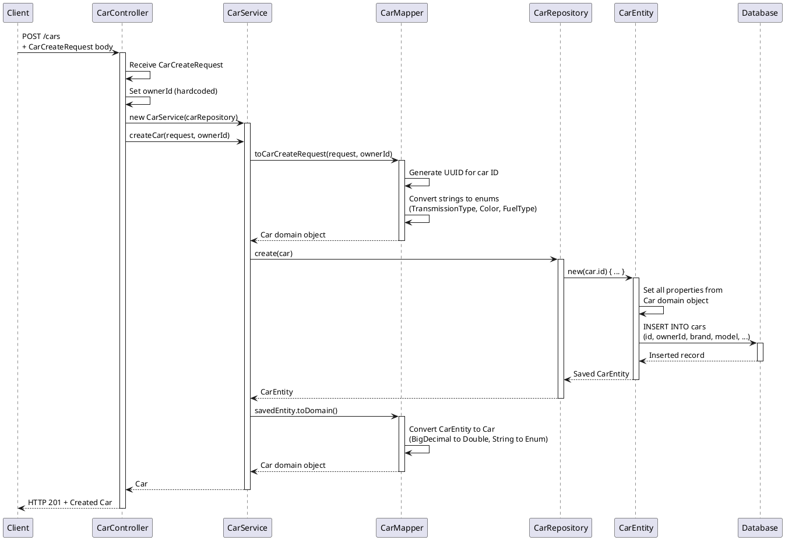
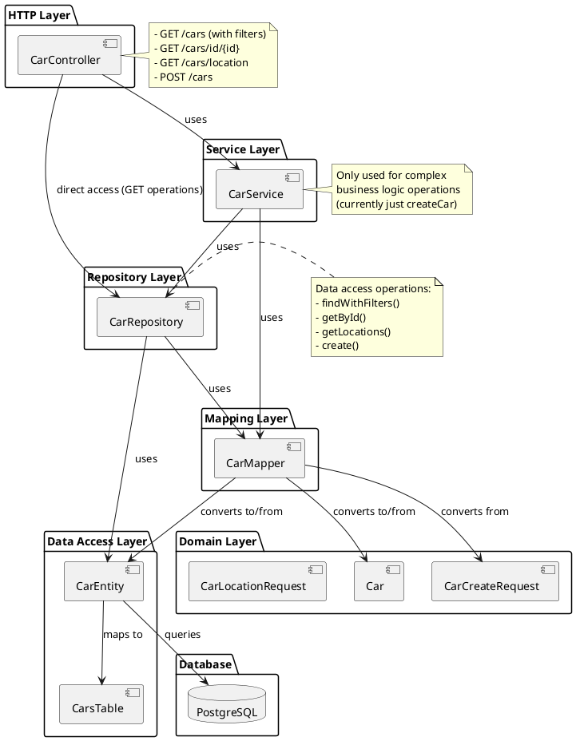

# Car Service Sequence Diagrams

This document contains sequence diagrams for the Car service operations in the LeafCar backend.

## 1. GET /cars (with filters)

## 2. GET /cars/id/{id}

## 3. GET /cars/location

## 4. POST /cars (Create Car)

## Architecture Overview

## Key Components Interaction Summary

1. **CarController**: Entry point handling HTTP requests and responses
2. **CarService**: Business logic layer (used only for car creation)
3. **CarRepository**: Data access layer with CRUD operations
4. **CarEntity**: Database entity using Exposed ORM
5. **CarMapper**: Converts between different object types (Entity ↔ Domain ↔ DTO)
6. **Domain Objects**:
    - `Car`: Core domain model
    - `CarCreateRequest`: Input DTO for car creation
    - `CarLocationRequest`: Output DTO for location data

## Data Flow Patterns

- **Simple Queries**: Controller → Repository → Database (bypasses Service layer)
- **Complex Operations**: Controller → Service → Repository → Database
- **Mapping**: Always done through CarMapper for type conversions
- **Error Handling**: HTTP status codes returned based on operation results